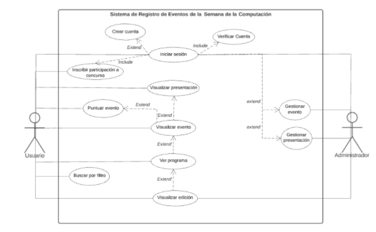

# Proyecto-Ing.-de-Software
## Propósito del proyecto
El presente proyecto tiene la finalidad de aplicar todo lo aprendido a lo largo del semestre del curso de ing de software de la carrera de ciencia de la computación de la Universidad Nacional de San Agustín.Ademas de ello, el presente documento tiene como propósito elicitar ,especificar y analizar los requisitos de software y definir las especificaciones funcionales y no funcionales para el desarrollo de un sistema web que gestiona distintintos eventos y ponencias. Este sistema será utilizado por personal de la Escuela de Ciencia de la Computación

## Tecnologias usadas
En el presente proyecto usamos HTML, CSS ; el gestor de Base de Datos se uso MySQL , para la conexion de la Base de Datos y el frontend se usó PHP 

## Funcionalidades
- Mostrar resumen general: El sistema debe mostrar información general de la Semana de la Computación, así como los ponentes más destacados, los eventos mejor puntuados y acerca de la escuela profesional de Ciencia de la computación.
- Inicio de sesión de usuario: los usuarios deberán identificarse para poder inscribirse a los concursos organizados por la escuela.
- Registrar usuario: El sistema debe permitir al usuario registrarse. El sistema pedirá al usuario ingresar su correo electrónico institucional (si es que es estudiante de la UNSA) o personal (si es un usuario no relacionado con la UNSA) y contraseña.
- Mostrar ediciones de la semana de la computación: El sistema lista los años en los que se realizó la Semana de la computación.
- Mostrar cronograma de eventos por edición: El sistema muestra al usuario el cronograma de la edición elegida. No es necesario que se inicie sesión para tener acceso a la vista. Desde el cronograma el usuario puede seleccionar un evento.
- Visualizar evento: El sistema permite a los usuarios en general tener acceso a los eventos. No es necesario que se inicie sesión.
  - Mostrar información general: Se muestra el título, información del ponente, tema, fecha, hora, lugar o link del evento.
  - Puntuar evento:  El usuario podrá dar una puntuación a los evento de acuerdo a su nivel de satisfacción. 
  - Visualizar material adjunto: El usuario puede visualizar las presentaciones se han adjuntado junto con el evento
- Gestionar eventos: 
  - Publicar evento: El sistema permite al administrador crear un evento, dependiendo el tipo de evento, el sistema pedirá que ingresar la información general del evento : 
  - Presentación: Ingresar un título, nombre del ponente, tema, descripción,  fecha, hora, lugar o link del evento.
  - Concurso: Nombre del concurso, área relacionada, descripción, nombre del docente a cargo, fecha, hora, link del evento.
  - Editar Evento: Solo el administrador puede editar la información de un evento.
  - Eliminar Evento:  Solo el administrador puede eliminar un evento.
- Registrar inscripciones para concursos: El sistema permite a un usuario inscribirse en un concurso. Para ello se requiere que se haya iniciado sesión.
- Buscar por filtro: El sistema permite al usuario buscar un evento por título o etiquetas.

  

## Práctica de código legible aplicadas
* No coloques JS ni CSS en las plantillas Blade y no coloques HTML en clases de PHP
### **Sigue la convención de Laravel para los nombres**

 Sigue los [estándares PSR](http://www.php-fig.org/psr/psr-2/).
 
 También, sigue la convención aceptada por la comunidad:

Qué | Cómo | Bueno | Malo
------------ | ------------- | ------------- | -------------
Controlador | singular | ControladorArticulo | ~~ControladorArticulos~~
Nombres de rutas | snake_case con notación de puntos | usuarios.mostrar_activos | ~~usuarios.mostrar-activos, mostrar-usuarios-activos~~
Modelo | singular | Usuario | ~~Usuarios~~
Relaciones hasOne o belongsTo | singular | comentarioArticulo | ~~comentariosArticulo, comentario_articulo~~
Propiedad de modelo | snake_case | $model->created_at | ~~$model->createdAt~~
Método | camelCase | traerTodo | ~~traer_todo~~
Vistas | kebab-case | show-filtered.blade.php | ~~showFiltered.blade.php, show_filtered.blade.php~~

* Convención de Laravel para los nombres
* Utiliza sintaxis cortas y legibles siempre que sea posible
* No coloques ningún tipo de lógica en los archivos de rutas.
* Nombres de las rutas.Usa nombres en línea con las convenciones internas de Laravel:
* Identación consistente:

   Siempre sera una buena praxis mantener una indentación ordenada. No hay un estilo ’mejor’ que todos deberían seguir. En realidad, el mejor estilo, es un estilo consistente. Si se es parte de un equipo o si se está contribuyendo con código a un proyecto, se debe seguir el estilo existente que se está utilizando en ese proyecto.También vale la pena señalar que es una buena idea mantener su estilo de identación de una manera coherente.
   
* Agrupación de código:

   Casi siempre ciertas tareas requieren unas pocas líneas de código. Es una buena idea mantener estas tareas dentro de bloques separados de código, con algunos espacios entre ellos.
* Organización de archivos y carpetas:

  Técnicamente, se podría escribir el código de una aplicación completo dentro de un solo archivo. Pero eso resultaría en una pesadilla para leer y mantener.
  Es por ello que siguiendo el MVC se organizaron las carpetas y archivos. 
* Comentar y Documentar: 

    Para un mejor entendimiento por parte de quien visualice el codigo, se ha comentado las funciones importantes.
* Longitud límite de línea:

   Es menos cansado leer 5 filas de amplitud corta que un largo texto a ras de hoja, por ello es una buena prática evitar escribir líneas largas y horizontales.

## Estilos de Programación aplicados
* Estilo de indentación
* Programacion Orientada a Objetos
* Código mantenible: 
   Esto quiere decir que pueda ser actualizado cada cierto tiempo y que así el programa perdure.
* Capitalizar Palabras Especiales de SQL: 
   La interacción de bases de datos es una gran parte de la mayoría de las aplicaciones web. Si está escribiendo consultas SQL sin procesar, es una buena idea mantenerlas    legibles también. A pesar de que las palabras especiales y los nombres de funciones de SQL no distinguen entre mayúsculas y minúsculas, es una práctica común escribirlas en mayúsculas para distinguirlas de sus nombres de tabla y columna.

## Principios SOLID aplicados
* Single-responsability : El principio de responsabilidad única ( SRP ) es un principio de programación de computadoras que establece que cada módulo , clase o función en un programa de computadora debe tener responsabilidad sobre una sola parte de la funcionalidad de ese programa , y debe encapsular esa parte. Todo eso de la función módulo, clase o servicios deben estar alineados estrechamente con esa responsabilidad.
  - Si una Clase tiene muchas responsabilidades, aumenta la posibilidad de errores porque hacer cambios en una de sus responsabilidades podría afectar a las otras sin que usted     lo sepa.
  -  "Una clase debe tener solo una razón para cambiar"
 Se eligió esta clase porque cumple con las características de este, es decir, la Clase User se encarga únicamente de recopilar la información de una persona como nombre, email, password.
  

  
  
      

Se eligió esta clase porque cumple con las características de este, es decir, la Clase Sesion Evento solo se encarga únicamente de recopilar datos como el id de una sesión, el id del evento y la hora de inicio de una evento.

  
      

El principio de responsabilidad única busca que el código quede encapsulado y exista independencia entre las clases, sus funcionalidades. Al utilizar clases hemos procurado cumplir con este criterio, ya que encapsulamos la funcionalidad de cada una para que realicen una única función. 

  
      

Por ejemplo, en la imagen se ve que se han independizado las funciones, entre ellas editar la sesión, y otras. Esto también ayuda a la reutilización del código en caso de cambios o mantenimiento. 

* Open-Closed:
Entonces una clase debe quedar abierto para extensión y cerrado para modificación. Para añadir funcionalidades debe escribirse nuevo código, no modificar código existente, escribir código que no se tenga que cambiar cada vez que cambian los requerimientos . Ej con herencia y polimorfismo

Por ejemplo la clase persona es la clase base que utilizaremos  para las clases usuario y ponente

  
      

*  Segregación de la Interfaz: 
Mejor tener una clase pequeña y especializada que una muy grande para targuetizar mejor las necesidades.
Según este principio es mejor tener una clase pequeña y especializada que una muy grande, para poder hacer un mejor objetivo hacia las necesidades del sistema. 
En nuestro trabajo, hemos procurado seguir esta norma al no sobrecargar las funcionalidades de las clases sin más de lo que se necesite. Por ejemplo en la captura se ve que cada función está dirigida a un único fin, aunque pertenezcan al mismo sistema, estan especializados. 

  
      

* Inversión de dependencia: 
  El principio de inversión de dependencia busca reducir el acople entre sistemas de software. 
  En nuestro caso, el sistema independiza la tecnología de bases de datos, ya que podríamos migrar con facilidad a otro sistema de bases de datos, pues utilizamos el framework Laravel, donde existe una abstracción que nos permite cambiar el tipo de BD utilizada mediante modificar algunos datos de forma sencilla. Esto nos brinda libertad para la implementación y cambiar de tecnología de BD afectando mínimamente las partes del sistema

  
  
  
  
 

No dependemos de la tecnología que empleamos en la base de datos, ya que la comunicación entre los componentes del sistema es siempre mediante interfaces, y esto nos permite tener libertad a la hora de decidir las implementaciones concretas de cada elemento. Por ejemplo, podríamos cambiar la conexión a la base de datos de mysql a mongodb o postgresql sin afectar a ninguna parte del sistema.

## Conceptos DDD aplicados

